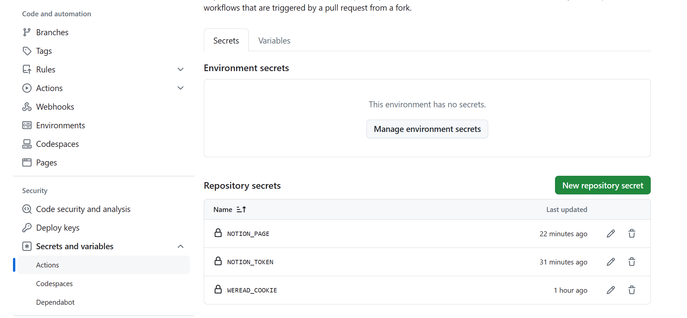

# 教程

## 1. 图文教程：

[WeRead2Notion-Pro强大的图书管理系统 (qq.com)](https://mp.weixin.qq.com/s/Wif_pyb5L3WlLLlj7iIPYw)

说明：通过此教程自动获取的notion参数会报错，建议使用下文notion参数获取方法。

## 2. 图文教程存档：

[WeRead2Notion-Pro强大的图书管理系统 (kdocs.cn)](https://www.kdocs.cn/l/cmQD5tyERrJe?from=docs)

----

# 参数获取

## 1. 微信读书的token获取

1. 需要重新获取，获取方法如下：

2. 浏览器打开网页版微信读书：https://weread.qq.com/扫码登录

3. 按F12进入开发者模式，依次点网络->文档，然后选中weread.qq.com，下拉找到Cookie，复制Cookie值

   

​	4. 要参照图片的值，有时候token会显示不完全。token过期时间不定。

## 2. notion参数获取

 1. 将博主的模板复制到个人。模板地址：https://malinkang.notion.site/13d2e1548f024687a42ec68a79a01c62

 2. 其他同步模块的模板（此项目用不到）：[修复Notion复制模板Bug (qq.com)](https://mp.weixin.qq.com/s/7Vxip1Kjtn-QwWkQldGRxQ)

 3. 复制个人的页面链接，链接地址即为 'NOTION_PAGE' 的参数值。

 4. 打开[Notion API](https://developers.notion.com/)，添加一个新的集成，此集成的密钥即为'NOTION_TOKEN'的值，填入设置中。

    

    

 5. 在个人模板页面链接到集成

    

    

##  3. 参数填写到项目:

1. 路径：Settings->Secrets and variables->Action->New repository secret

   

2. Name输入WEREAD_COOKIE，Secret输入框中填入你前面获取的微信读书Cookie，然后点击Add secret

3. 继续点击New repository secret，分别增加变量NOTION_TOKEN和NOTION_PAGE。最终的结果如下图所示。

   

-----

# 报错解决

1. 报错如下：

   ```
   notion_client.errors.APIResponseError: path failed validation: path.database_id should be a valid uuid, instead was `"None"`.[55](https://github.com/glm-cn/weread2notion-pro/actions/runs/9337456629/job/25699381755#step:5:56)Error: Process completed with exit code 1.
   ```

   解决：

   通过博主自动生成的notion参数有误。使用手动办法获取。

2. 微信读书token过期

   微信读书token的过期时间不确定，查看错误确定后，重新获取微信读书token

   
